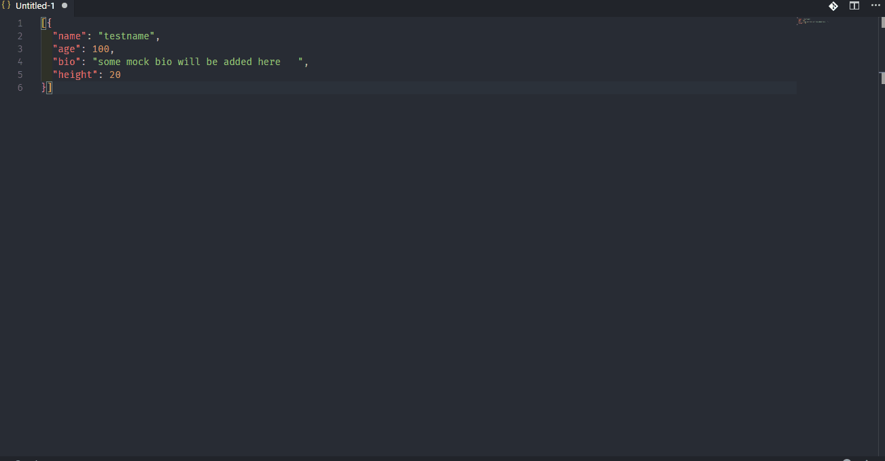

# mock-data-generator README

Simple extension to generate mock data for emergency

give the mock data strucuture (array of object)

```
[{
  'users': [1, 2, 3],
  'name': 'test',
  'age': 200
}]

```
and generate using **ctrl+shift+p > Generate mock data** and give the number of records to be generated. When the value is string (in array of object) the maximum length of text generated depends on the one given by user.


